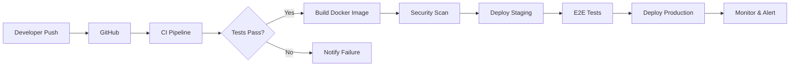

# CI/CD Pipeline Documentation

## 📋 Overview

This repository implements a comprehensive CI/CD pipeline for the Military Digital Transformation project using GitHub Actions, Docker, and automated deployment strategies.

## 🏗️ Architecture



## 🚀 Pipelines

### 1. Continuous Integration (`ci.yml`)

**Triggers:**
- Push to `main` or `develop` branches
- Pull requests to `main`

**Jobs:**
- **Lint & Type Check**: ESLint, TypeScript, Prettier
- **Unit & Integration Tests**: Vitest with coverage
- **Build**: Application build and artifact upload
- **Security Scan**: Trivy and npm audit
- **Performance**: Lighthouse CI testing

### 2. Continuous Deployment (`cd.yml`)

**Triggers:**
- Push to `main` branch
- Manual workflow dispatch

**Stages:**
1. **Staging Deployment**
   - Build with staging environment variables
   - Deploy to Vercel staging
   - URL: `https://staging.military-training.app`

2. **E2E Testing**
   - Playwright tests on staging environment
   - Test report artifacts

3. **Production Deployment**
   - Build with production environment variables
   - Deploy to Vercel production
   - Sentry release creation
   - URL: `https://military-training.app`

4. **Notifications**
   - Slack notifications for deployment status

### 3. Docker Build & Push (`docker.yml`)

**Features:**
- Multi-platform builds (AMD64, ARM64)
- GitHub Container Registry (ghcr.io)
- Vulnerability scanning with Trivy
- Layer caching for faster builds

### 4. Release Management (`release.yml`)

**Triggers:**
- Version tags (`v*`)

**Process:**
1. Generate changelog
2. Create GitHub release
3. Build release assets for multiple platforms
4. Publish to NPM (if applicable)
5. Deploy to production

### 5. Security Scanning (`security.yml`)

**Scheduled:** Weekly on Mondays

**Scans:**
- **CodeQL**: Static code analysis
- **OWASP Dependency Check**: Vulnerability scanning
- **TruffleHog**: Secret detection
- **Trivy**: Container security
- **Semgrep**: SAST scanning

## 🐳 Docker Configuration

### Dockerfile

Multi-stage build:
1. **Builder Stage**: Node 20 Alpine, build application
2. **Runner Stage**: Minimal production image with non-root user

### docker-compose.yml

Services:
- **App**: Main application container
- **Nginx**: Reverse proxy with SSL termination

## ⚙️ Configuration Files

### Required Secrets

```yaml
# GitHub Secrets
GITHUB_TOKEN: Auto-generated

# Vercel Deployment
VERCEL_TOKEN: Your Vercel API token
VERCEL_ORG_ID: Your Vercel organization ID
VERCEL_PROJECT_ID: Your Vercel project ID

# Environment URLs
STAGING_API_URL: https://api-staging.military-training.app
PRODUCTION_API_URL: https://api.military-training.app

# Monitoring
SENTRY_DSN: Your Sentry DSN
SENTRY_AUTH_TOKEN: Sentry auth token
SENTRY_ORG: Your Sentry organization
SENTRY_PROJECT: Your Sentry project

# Notifications
SLACK_WEBHOOK_URL: Your Slack webhook URL

# Security
SNYK_TOKEN: Your Snyk token (optional)
NPM_TOKEN: NPM publish token (if publishing)
```

### Environment Variables

```bash
# .env.example
VITE_API_URL=https://api.military-training.app
VITE_APP_ENVIRONMENT=production
VITE_SENTRY_DSN=your_sentry_dsn
```

## 📦 Dependencies Management

### Dependabot Configuration

- **npm**: Weekly updates on Mondays
- **GitHub Actions**: Weekly security updates
- **Docker**: Weekly base image updates

## 🔧 Local Development

### Running CI/CD Locally

```bash
# Install act for local GitHub Actions testing
brew install act # macOS
# or
curl https://raw.githubusercontent.com/nektos/act/master/install.sh | sudo bash # Linux

# Run CI pipeline locally
act push -W .github/workflows/ci.yml

# Run with secrets
act push -W .github/workflows/cd.yml --secret-file .env.secrets
```

### Docker Development

```bash
# Build Docker image
docker build -t military-training-app:local .

# Run with docker-compose
docker-compose up -d

# Check logs
docker-compose logs -f app

# Stop services
docker-compose down
```

## 📊 Performance Metrics

### Lighthouse Thresholds

- **Performance**: ≥ 80%
- **Accessibility**: ≥ 90%
- **Best Practices**: ≥ 90%
- **SEO**: ≥ 90%
- **PWA**: ≥ 70%

### Build Performance

- **FCP**: < 2s
- **LCP**: < 3s
- **TTI**: < 3.5s
- **CLS**: < 0.1

## 🚨 Monitoring & Alerts

### Health Checks

```javascript
// Health endpoint at /health
app.get('/health', (req, res) => {
  res.status(200).json({
    status: 'healthy',
    version: process.env.APP_VERSION,
    timestamp: new Date().toISOString()
  });
});
```

### Deployment Notifications

Slack notifications include:
- Deployment status (success/failure)
- Branch name
- Commit SHA
- Deployer username

## 🔒 Security Best Practices

1. **No secrets in code**: All sensitive data in GitHub Secrets
2. **Dependency scanning**: Weekly automated updates
3. **Container security**: Regular base image updates
4. **Code analysis**: CodeQL and Semgrep scanning
5. **HTTPS only**: SSL/TLS enforced via Nginx

## 📝 Workflow Commands

### Manual Deployment

```bash
# Trigger deployment workflow
gh workflow run cd.yml --ref main

# Check workflow status
gh run list --workflow=cd.yml

# View workflow logs
gh run view [run-id] --log
```

### Release Creation

```bash
# Create a new release
git tag -a v1.0.0 -m "Release version 1.0.0"
git push origin v1.0.0

# The release workflow will automatically trigger
```

## 🆘 Troubleshooting

### Common Issues

1. **Build Failures**
   ```bash
   # Check Node version
   node --version # Should be v20.x

   # Clear cache and reinstall
   rm -rf node_modules package-lock.json
   npm install
   ```

2. **Docker Build Issues**
   ```bash
   # Clean Docker cache
   docker system prune -a

   # Rebuild without cache
   docker build --no-cache -t military-training-app:local .
   ```

3. **Deployment Failures**
   - Check GitHub Secrets configuration
   - Verify Vercel project settings
   - Review deployment logs in GitHub Actions

## 📚 Additional Resources

- [GitHub Actions Documentation](https://docs.github.com/en/actions)
- [Docker Best Practices](https://docs.docker.com/develop/dev-best-practices/)
- [Vercel Deployment](https://vercel.com/docs)
- [Lighthouse CI](https://github.com/GoogleChrome/lighthouse-ci)

## 🤝 Contributing

1. Create feature branch
2. Make changes and test locally
3. Push to GitHub
4. CI pipeline will run automatically
5. Fix any issues reported
6. Create pull request when all checks pass

## 📄 License

This CI/CD configuration is part of the Military Digital Transformation project.